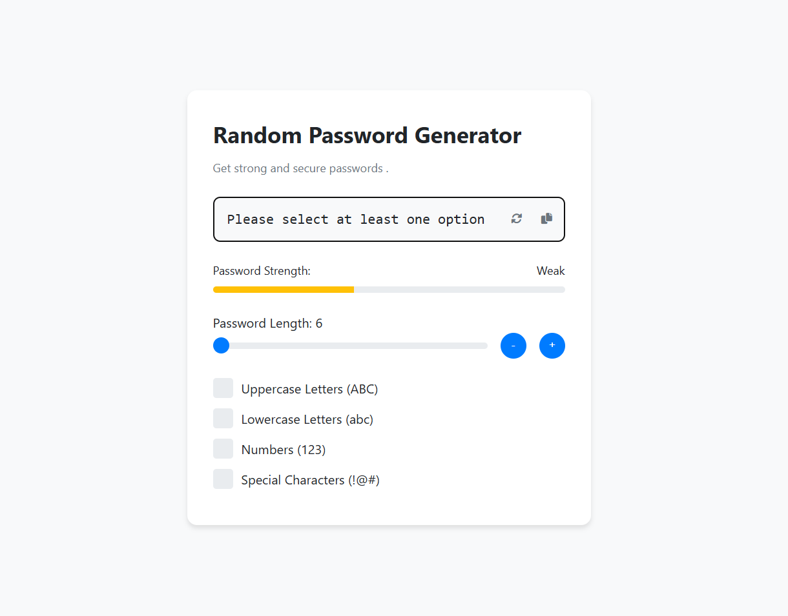

# Random Password Generator

A modern, secure password generator built with HTML, CSS, and JavaScript. Generate strong passwords with customizable options and get instant feedback on password strength.

## Features

- 🔐 Generate secure random passwords
- 📏 Adjustable password length (6-32 characters)
- 🎯 Customizable character sets:
  - Uppercase letters (A-Z)
  - Lowercase letters (a-z)
  - Numbers (0-9)
  - Special characters (!@#$%^&*()_+-=[]{}|;:,.<>?)
- 💪 Real-time password strength indicator
- 📋 One-click copy to clipboard
- 🔄 Instant password regeneration
- 📱 Responsive design for all devices

<<<<<<< HEAD
=======

>>>>>>> 7dd6e3bcb58429279c25c2f1cc89623f344285c8

